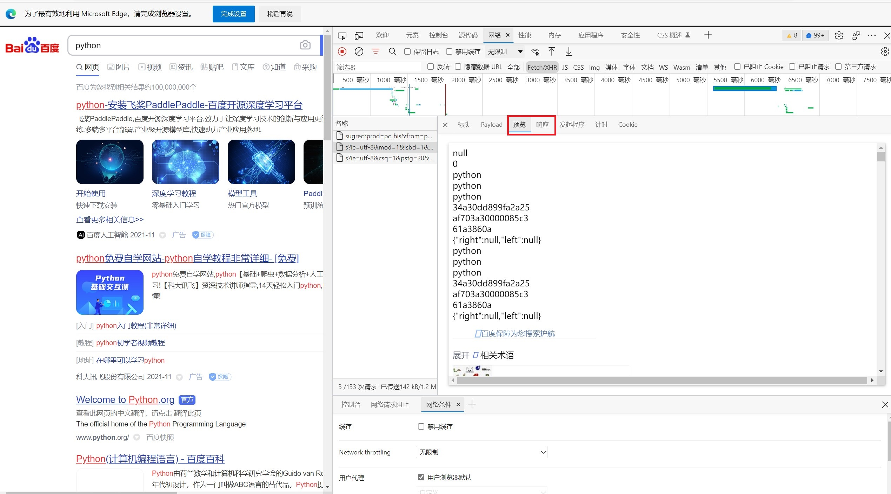
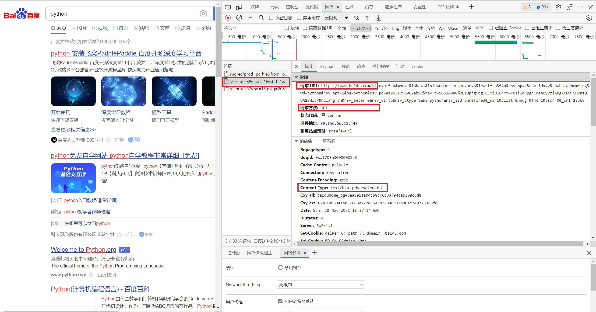
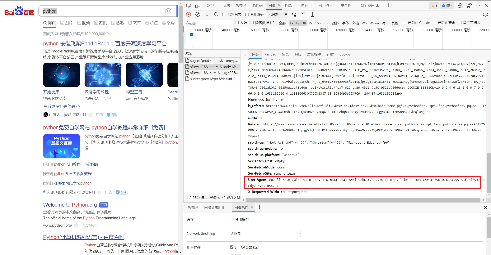

#MyDevelopmentDiary
----------------------------------------------
##OneDay                     2021/11/28
----------------------------------------------

网页信息爬取

导入包：import requests

先要进行网站页面数据分析

<li>第一步

F12进入开发者模式后，点击网路，选择Fetch/XHR,或者文档。

过滤多余干扰项

<li>第二步

点击预览或者相应，确认其中的内容。

判断该请求路径是否为需要的路径

<li>第三步

确定请求URL

确定请求方法

确定请求方法

确定Content-Type

<li>第四步

确定User-Agent

Response通信

url：请求URL

params：？后面的参数，可以在上述的第三步中选择PayLoad选项卡查看

headers：连接头，要设置'User-Agent'进行UA伪装

如果返回是html格式的话

response = requests.get(url=url,params=parm, headers=header)

如果返回是json格式的话

response = requests.get(url=url,params=parm, headers=header).json()

上述 requests.get可以换成 requests.post
